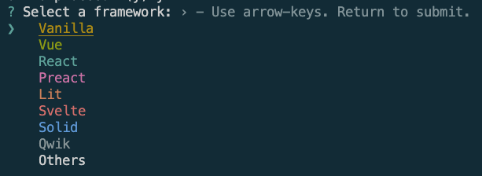

# React入門勉強


## Reactを始めるにあたっての手順

### npx create-ract-appを使う手順

1. Node.jsが入っているか確認する
```[bash]
$ node -v
#  v21.7.3
```

2. Reactのプロジェクトを作成する
```[bash]
npx create-react-app <プロジェクト名>
```

3. ローカル環境で動かす
```[bash]
npm start
```
webブラウザでReactのロゴが回っている画面が出れば環境構築はOK(localhost:3000)

4. 不要なコードやファイルは消去しておく

`src`ディレクトリ内の
- App.test.js
- logo.svg
- reportWebVitals.js
- setupTests.js
- App.jsの`import logo from './logo.svg';`
- App.jsの`clasName='App'`内のコード
- index.jsの`import reportWebVitals from './reportWebVitals';`
- index.jsの14~17行目
- App.cssの中身を全て消去

5. App.jsを編集してアプリを作っていく！

### viteを使う手順
こっちの方が早く作成できる

1. プロジェクト作成
次のコマンドを実行
```
npm craete vite@latest <プロジェクト名>
```

2. 使うフレームワークを選択する
reactを選択


3. 必要なモジュールをインストールする
```
npm i
```

4. 立ち上げる
```
npm run dev
```

## ToDoリスト


## memo
### 新しくコンポーネントを作成するとき
1. VSCodeの拡張機能「ES7+ React/Redux/React-Native snip」をインストール
2. <component name>.jsを作成
3. `rafce`と入力して補完されるものを使う
4. 次のコードが作成される
```
import React from 'react'

const component_name = () => {
  return (
    <div>component_name</div>
  )
}

export default component_name
```

5. App.jsに`import component_name from ./component_name`を追加する

### Tailwind
Reactに適しているCSSフレームワーク

インストール
```
npm install -D tailwindcss postcss autoprefixer
npx tailwindcss init -p
```

postcss.config.jsとtailwind.config.cssが作成される．

tailwind.config.jsのcontentを編集して反映させる
`content: ["./src/**/*.{js,jsx,ts,tsx}", "./public/index.html"],`

./index.cssに次を追記
```
@tailwind base;
@tailwind components;
@tailwind utilities;
```

divタグやh1タグなどに`class=""`をつけて反映させる

## 参考
- [【React入門】完全初心者OK! 1から簡単なToDoアプリを作ってReactの一歩を踏み出してみよう ~Reactチュートリアル~](https://youtu.be/nRCNL9T3J98?si=ebt7RYN4rS107ZJz)
- [React公式](https://ja.react.dev/)
- [【React】ReactアプリにTailwind Cssを導入する手順](https://qiita.com/y_kato_eng/items/439dae65ba13d050c91e)
- [tailwindcss](https://tailwindcss.com/)
- [【React入門】](https://youtu.be/uuAdVs7sbAs?si=ncF5AZJhDkdNX6ua)
